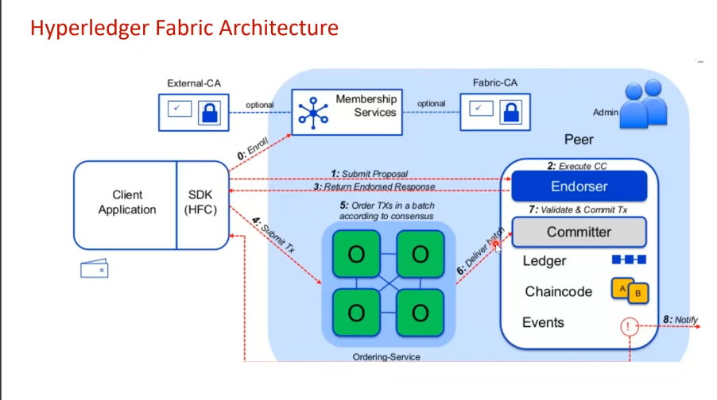

## Hyperledger Fabric 2.x versions list

- Check Hyperledger Fabric version 2.2 -> [v2.2](https://github.com/vikash-ftw/HyperledgerFabric-v2-setup/tree/main)

- Check Hyperledger Fabric version 2.5 (currently in development) -> [v2.5](https://github.com/vikash-ftw/HyperledgerFabric-v2-setup/tree/release-2.5)

## Fabric Architecture Overview



## Steps to Run Fabric Network Locally

#### Fresh Setup on Ubuntu Machine

- Download or check the required dependencies: [Dependencies](https://docs.google.com/document/d/1cF6vgNphqKYm4eFN2bJQcwKCz01P7u8SSJJ9oXDqGSs/edit?usp=sharing)

1. Make sure to remove `hyperledger` directory (if present) under `/var` directory on your system.

2. Run this script to install all fabric binaries of specific version mentioned in script.

```bash
./loadFabricDependencies.sh
```

   - Check new folders created by this script -> `bin` and `config` directories.

> :memo: **Note:** We can generate certificates and cryptographic key pairs (crypto-materials) that authenticate and authorize entities on the network via cryptogen (For testing and development purpose) or Fabric CA (For Production purpose) - We will use Fabric CA in our case.

> :memo: **Note:** From now onwards for all the below steps our `FabricV2_SampleNetworkApp` directory will be our `project_home` to follow further step.

```bash
cd FabricV2_SampleNetworkApp
```

3. Now we run this script from `project_home` to start fabric-ca containers needed for crypto-materials. 

```bash
./scripts/start_fabric-ca.sh
```

   - Check new fabric ca containers will be up and running.
   - Also check fabric-ca (volume mapped data directory for fabric-ca containers) created under `organizations` directory.

4. Next we run this script from same `project_home` to create `crypto-materials` for peers, orderers and other participating entities.

```bash
./scripts/registerEnroll.sh
```

   - Check out `ordererOrganizations` and `peerOrganizations` directories under `organizations` directory containing all crypto-materials related to our `peers` and `orderers`.

5. Next run this script to create `CCP(Common Connection Profile)`, this will be needed by application to connect with network.

```bash
./organizations/ccp-generate.sh
```

   - Check out `./organizations/peerOrganizations/org1.example.com/` directory having these two `connection-org1.json` and `connection-org1.yaml` files containing all connection details of our Peer nodes.

6. Next we create genesis block of our network.

```bash
./createFirstGenesisBlock.sh
```

   - Check out `system-genesis-block` directory containing `genesis.block` file.

7. Now finally we start our network to build and run our `peers`, `orderers`, `couchDB` and other network containers.

```bash
./scripts/start_network.sh
```

   - Check out new peers, orderers, couchDB and other network containers building up and running.
   - Also check out `/var/hyperledger` directory (volume mapped data directory for all our peers, orderers and couchDB containers)
   - **Make sure none of the containers enters the 'Exited' state. Wait for approximately 5-8 seconds, then check the status of the containers.**

8. Now next we create our  network `channel` related files and join peers to this newly created channel.

```bash
./scripts/createChannel.sh
```

   - Check out `channel-artifacts` directory containing 3 files : `anchor` and `channel` related `.tx` files and also `.block` file of channel.

9. Now comes `chaincode` i.e. our `smartcontract` part, in fabric 2.x version new chaincode 4 stage lifecycle is introduces i.e. `1.package`, `2.install`, `3.approve` then finally `4.commit` the chaincode for smartcontract deployment in Fabric.

```bash
./scripts/deploySmartContract.sh
```

   - Check out `fabricLedgerContract.tar.gz` file created at `package` stage.
   - Also check out new `dev-peer containers` built up and running there are known as `chaincode containers` with their specific `smartcontract version` like `v1`, `v2` and so on.

10. (*OPTIONAL STEP*) : For testing chaincode invocation. This will check if chaincode is working via `peer chaincode invoke` command.

```bash
./scripts/invokeContract.sh
```

   - Check if invoked transaction is `committed` or `failed` - if successfully committed then chaincode is fine and ready to handle request by our application.

11. Now we change our directory to this `./organizations/clientOrg/app` directory to run our application.
   ```bash
   cd organizations/clientOrg/app
   ```
- Installation of node modules packages. *(Node version must be v20.14)*
```bash
npm i
```
- Finally start our node server. 
```bash 
npm start
```

If server start smoothly without showing any error then -
   - Check out `./organizations/clientOrg/app/identity` directory containing `wallet` identities for our `admin` and `user`. These are generated as identities for our client application.
   - This newly created user identity generated via `fabric CA` will now be used by out application to invoke chaincode.
   - Finally our client app is ready to handle request and invoke chaincode so now test the application.

To access the CouchDB ledger UI on browser go to `http://localhost:5984/_utils/#` 

#### Fabric CA Certificate Renewal - [Document](https://docs.google.com/document/d/1eoL_KFoH2jLIeprtTKx73gT3Le-nTqMd_XN26-QyMYs/edit?usp=sharing)

## Additional AddOn Features
### Hyperledger Explorer

An `interactive` and `real-time` visualizations of our fabric blockchain and its data related insights in a user-friendly manner.

Run this script from `FabricV2_SampleNetworkApp` directory -

```bash
./scripts/start_explorer.sh
```
Now you can access the Explorer UI on browser with port **8080**.

If facing any error in accessing Explorer UI then check the container logs of explorer via `docker logs <container_name/Id>` command, there are two explorer containers one for explorer database and another one for main explorer. So check the main explorer container with name `explorer.mynetwork.com` and image name `ghcr.io/hyperledger-labs/explorer`.

### On Chain to Off Chain Data Sync

Syncing On Chain blocks data to Off Chain database for following below purpose -

- Handle `complex queries`.
- To create `analytics` and `statistical` dashboard therefore handle its `repeated query load` via Off Chain database. This reduces the On Chain ledger network load.

First Run the mongodb in a Dockerized way.

```bash
docker run -d -p 27017:27017 -v /var/mongo_offchaindb/:/data/db --name mongo_offchaindb mongo:8.0.10
```

Then edit this Enviroment variable - `ALLOW_OFFCHAIN_SYNC` in a .env file at app directory (`FabricV2_SampleNetworkApp/organizations/clientOrg/app/.env`) by default this variable is set to `false` to set it `true`. Now stop the node server and run it again after saving these changes.

Here MongoDB will run on the port **27017**. 

To view the data on GUI then checkout Compass, download and install it on your OS - [MongoDB_Compass](https://www.mongodb.com/products/tools/compass)

`In case if you running your own full non dockerized version of mongodb then edit OFFCHAIN_MONGODB_ADDRESS environment variable in same .env file.`


## Tech Stack

**Application Server:** Node, Express, JS

**Blockchain Backend:** Hyperledger Fabric, SmartContract, Docker, Shell Script

## Authors

- [@vikash-ftw](https://github.com/vikash-ftw)


## Feedback

If you have any feedback, please reach out to me at vikashbatham97@gmail.com

## Stars 🌟

***If you loved my work then please leave a  Star ⭐ to this Repository.***

[](https://starchart.cc/vikash-ftw/Hyperledger-Fabric-v2)